[Concordion](http://www.concordion.org) is an open source framework for Java that lets you turn a plain English description of a requirement into an automated test.
 
This project enables concordion to parse an Excel spreadsheet and use it as input data.   

Vanilla Concordion is designed to process test specifications written in using a combination of an HTML Document
and a Java fixture class.  When Concordion runs the test, it takes the HTML document and uses it as as the basis 
of a test report, colouring the report as it goes to show which parts of the test have passed and failed.

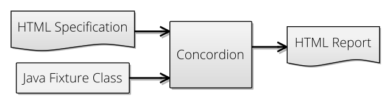

The Concordion Excel Extension changes this so that the HTML Document is replaced by an Excel spreadsheet.  
The spreadsheet is parsed into an HTML structure first, and then from there on processed through Concordion 
in the normal way.  

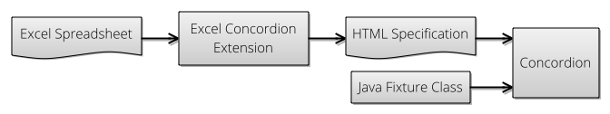

Motivation
----------

So, the extension simply gives you a different format for your test specification.  Why would it be sometimes
preferable to represent this as an Excel document rather than an HTML one?  Three reasons:

1.  Perhaps the team of test writers are not familiar with writing HTML, or are more comfortable with Excel.
2.  You're constructing lots of tables containing the test examples.  Excel's table support is very polished and easy to use compared 
to most HTML editors, or HTML-by-hand.
3.  You're testing calculations which can be easily expressed in Excel functions.  It makes sense for the testers to write
examples using the functions rather than calculating them by hand and putting the results into the test specification.  In fact, if you're
here, your testers are probably calculating the test examples using Excel anyway.

Tutorial
========

This tutorial is designed to show you how to take advantage of the Concordion Excel Extension 
to build an automated acceptance test.

In this example, we are going to develop some Java code and an accompanying test.  The purpose of the code will be to 
calculate a taxi fare, which is a function of the distance travelled.   Yes, this is a contrived, simplified
example, but this approach has been used for developing software for financial systems, so it is at least in an appropriate domain.

The Specification
-----------------

The cab fare is priced as follows:

1. £1 flat rate is applied at the start of the journey.
2. Over the first 10 miles, the charge is £.50 per mile.
3. Then on, the charge is £.30 per mile.

Constructing the Excel Spreadsheet
----------------------------------

Based on the specification, we might design a spreadsheet that looks something like this: 

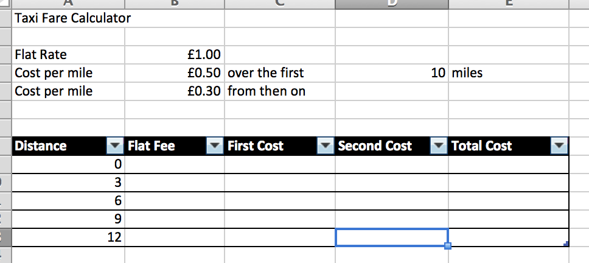

It contains all of the constants defined from the specification, at the top.  Below that is a table for some example calculations.
By selecting a range of cells and using Insert->Table, you tell Excel that this area is a table.   This is important to the 
Concordion extension too, so that it knows to output this area as an HTML table.

Next we need to do is fill out the example table section.  The flat rate is an easy function - it's always the same.  Note:  the cells in the spreadsheet are named, to make the formulae 
easier to read.

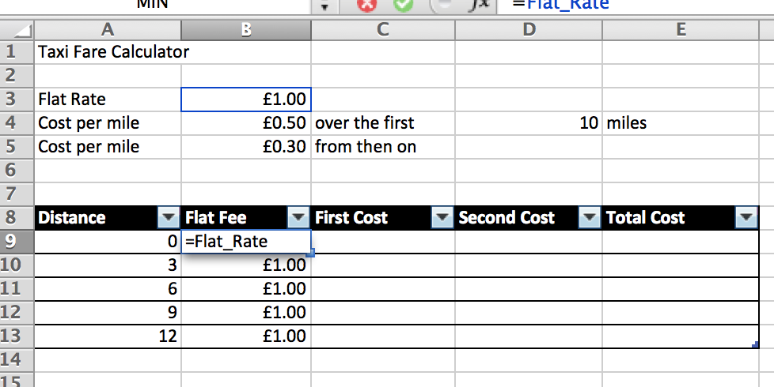

The first mileage is easy too.   If the journey is less than 10 miles, it's the mileage multiplied by the first cost per mile.  You can see the formula in the top right of the below image.

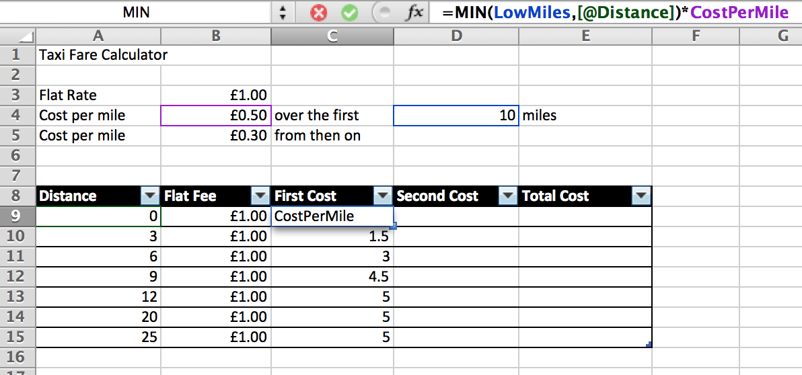

The second mileage looks at the remainder.  I've used the MAX function, and worked out how many miles over 10 were travelled.

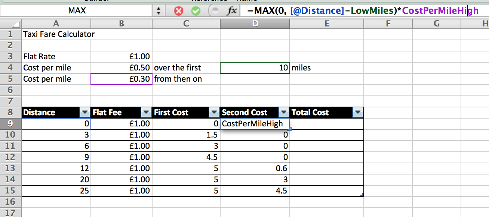

The total cost is the sum of all three components in the next column.

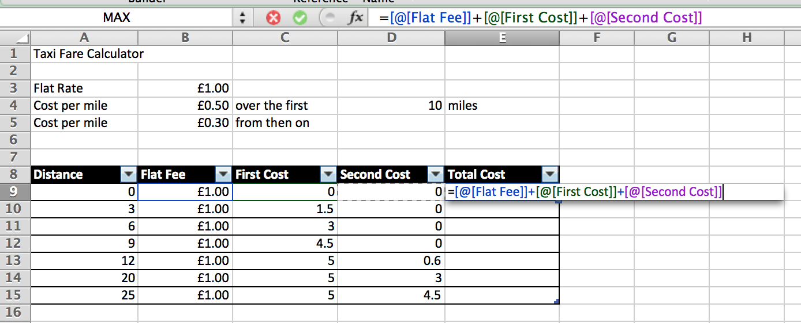

Turning it into a test.
-----------------------

Concordion is designed as a JUnit runner.  This means to tell JUnit to use Concordion , When the class is annotated with:

	@RunWith(ConcordionRunner.class)

then it will use the concordion runner.   We need to extend it so that it expects to load an Excel specification, rather than
HTML as is usually the case with concordion.  

	package spec.concordion.ext.excel;
	
	import org.concordion.api.extension.Extensions;
	import org.concordion.ext.excel.ExcelExtension;
	import org.concordion.integration.junit4.ConcordionRunner;
	import org.junit.runner.RunWith;
	
	@RunWith(ConcordionRunner.class)
	@Extensions(ExcelExtension.class)
	public class FirstTutorial {
	
	}

Running the Test
----------------

When we run this test, Concordion generates the following HTML output:

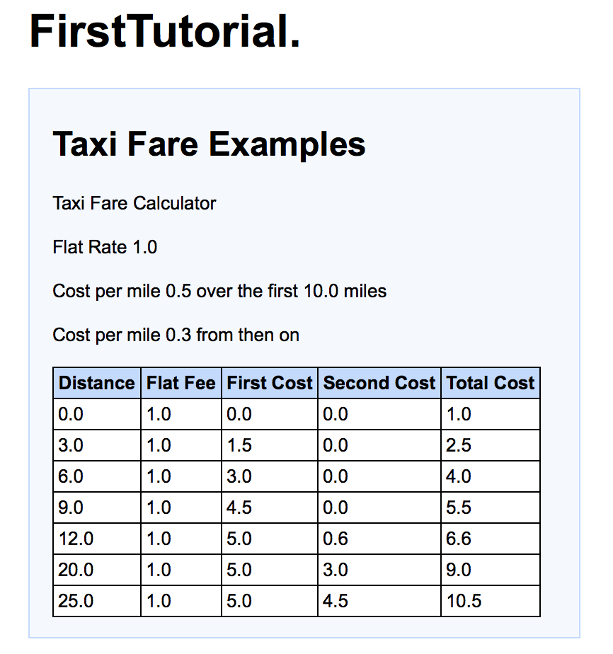

Wiring Up The Constants
-----------------------

This is not yet a test, though, as we haven't made any assertions of our code.  So, next let's link the Excel spreadsheet to the java 
implementation.  To do this, let's set concordion variables from the values on the sheet.  

To do this, we add excel comments containing our concordion commands.  This follows the approach when we design an HTML concordion test and
add attributes to our HTML elements.  Here is an example:

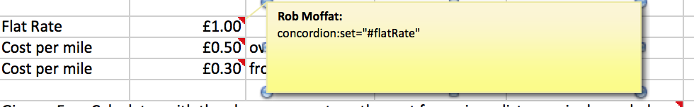

The way this works is that the Concordion Excel Extension tries to parse the contents of Excel comments it finds in your spreadsheets.  When
it finds one that looks like an HTML attribute (i.e. `name="value"`) it adds this to the concordion test model, and executes the appropriate
concordion command.   Malformed attributes, or regular Excel comments are ignored.

Repeating the process for the other variables, we end up with our four concordion variables set:

1. #flatRate
2. #cpm1
3. #cpm1Upper
4. #cpm2

Wiring Up the Table
-------------------

Let's do the same for the Excel table.  Concordion is clever enough to understand that commands applied to the table
header rows are applied to the cells within the table, row-by-row.  So we can set distance just once like this:]

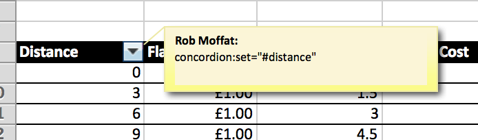

Let's also add the check for the result, where we assert that the result of the calculation is the same as the value 
contained in the cell. 

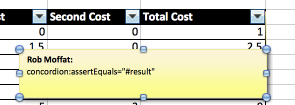

Finally, we must call the java code to make the calculation.  In concordion, this is applied to the whole table, and
so we need to indicate this to our Excel spreadsheet too:

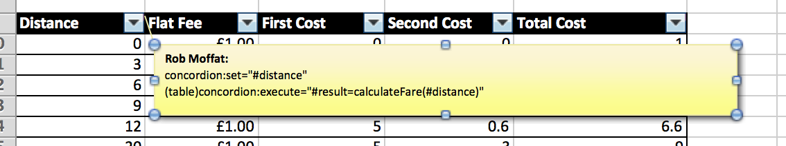

Let's just understand what this means:  we are going to call the java code `calculateFare` with  `#distance` supplied
as an argument, and then store the value in the `#result` variable.  And, by adding `(table)` to the start of the directive, 
we are telling concordion that this is a command applying to the whole table, and that it should repeat this operation for 
each row of the table in turn.

If you understand how concordion works when processing HTML, then this might seem a bit magical.  As discussed earlier, the
way the Concordion Excel Extension works is that it converts the spreadsheet into an HTML representation.  The brackets are 
a directive to tell the processor to not put the command on the current HTML element, but on a parent element with the matching tag
(in this case: work up the HTML heirarchy until you find the table tag, and add the command there). 

So now, we need some java code to make this work.

Code for calculateFare
----------------------

	package spec.concordion.ext.excel;
	
	import org.concordion.api.extension.Extensions;
	import org.concordion.ext.excel.ExcelExtension;
	import org.concordion.integration.junit4.ConcordionRunner;
	import org.junit.runner.RunWith;
	
	@RunWith(ConcordionRunner.class)
	@Extensions(ExcelExtension.class)
	public class FirstTutorial {
		
		private FareCalculator fc;
		
		public String calculateFare(String distance) {
			double result = fc.calculateFare(Double.parseDouble(distance));
			return ((Double)result).toString();
		}
		
	}

What's been added here is code to call a FareCalculator object, which is the class being tested.  This looks something like this:

	package spec.concordion.ext.excel;
	
	public interface FareCalculator {
	
		/**
		 * Returns price in GBP for a given distance in miles.
		 */
		double calculateFare(double parseDouble);
	
	}
	
What's missing though is the constructor for the `fc` field above: we have not created a FareCalculator object yet, or an implementation
of FareCalculator to call.  Such an implementation could look like this:

	package spec.concordion.ext.excel;
	
	public class BasicFareCalculator implements FareCalculator {
	
		double flatRate;
		double costPerMile1;
		double costPerMile1UpperLimit;
		double costPerMile2;
		
		public BasicFareCalculator(double flatRate,
				double costPerMile1,
				double costPerMile1UpperLimit, 
				double costPerMile2) {
			this.flatRate = flatRate;
			this.costPerMile1 = costPerMile1;
			this.costPerMile1UpperLimit = costPerMile1UpperLimit;
			this.costPerMile2 = costPerMile2;
		}
	
		@Override
		public double calculateFare(double distance) {
			return flatRate 
					+ Math.min(costPerMile1UpperLimit, distance) * costPerMile1
					+ Math.max(0, distance-costPerMile1UpperLimit) * costPerMile2;
		}
	
	}

Note the similarity between the Java code to calculate the fare, and the Excel functions to do the same.

Constructing The Basic Fare Calculator
--------------------------------------

The final piece of the puzzle is to instantiate the `fc` field on the test, with a `BasicFareCalculator` object.

To do this, I am going to add an extra line to the spreadsheet for us to instrument:

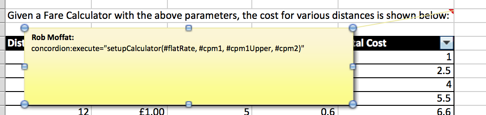

This is calling a java method on our test called `setupFareCalculator`, and it passes the 5 parameters from the sheet that 
we created earlier.

Here is the Java implementation to complete this:

	public void setupCalculator(String flatRate, String cpm1, String cpm1Upper, String cpm2) {
		
		fc = new BasicFareCalculator(Double.parseDouble(flatRate), 
				Double.parseDouble(cpm1),
				Double.parseDouble(cpm1Upper),
				Double.parseDouble(cpm2));
	}
	
We're Done
----------

When the test is run, this is the HTML report:

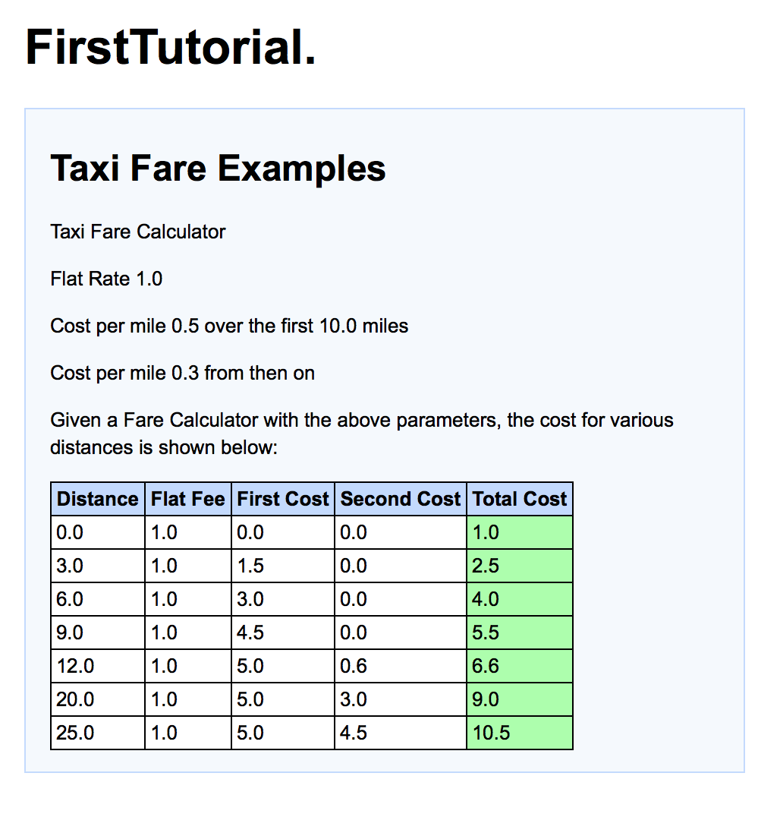

Conclusion
----------

Writing a test in Excel is really no harder than writing it in HTML, as we have seen.  

But, one of the huge benefits of this approach is that we can now play with the spreadsheet, changing the constants, and
be certain that our test will still work.   For example, if I change the cost per mile to £0.60p instead of £0.50p, the result
looks like this:

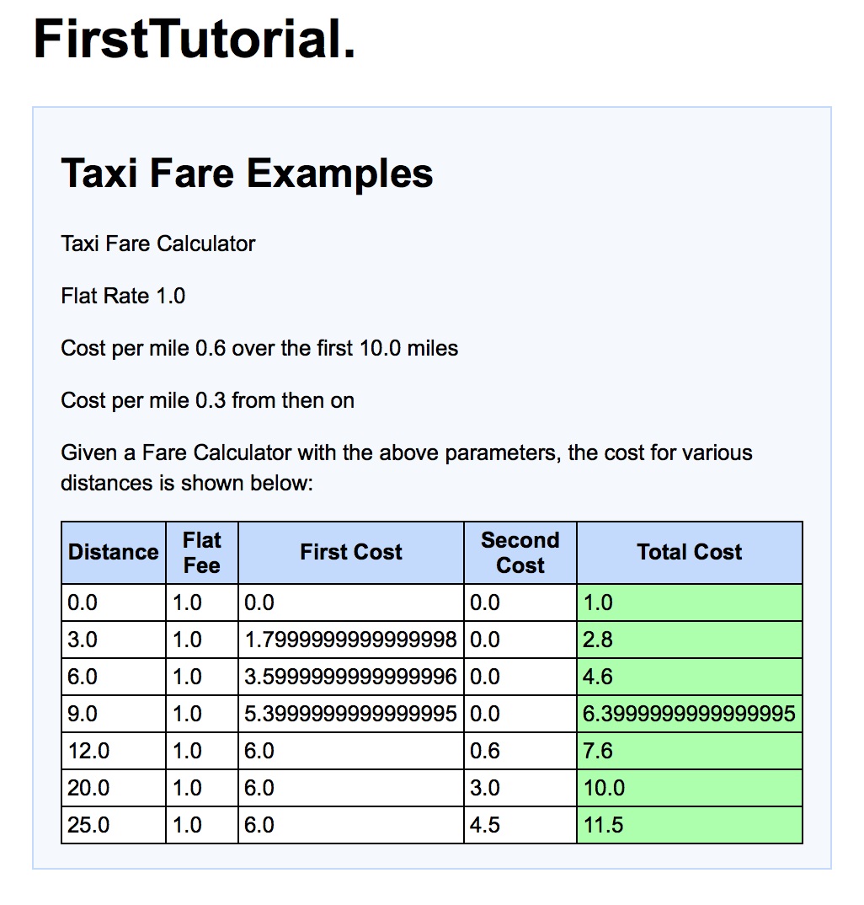

And no other changes are necessary - Excel takes care of updating the results of the test.

Note on Windows / Eclipse Usage
===============================

Eclipse gets confused about Windows Temporary Files if they are in the build path  (e.g. src/test/resources).  This means
that if you have Excel open, Eclipse stops building your project.   But, there is a simple workaround for this, which is 
to add an exclusion pattern like so:

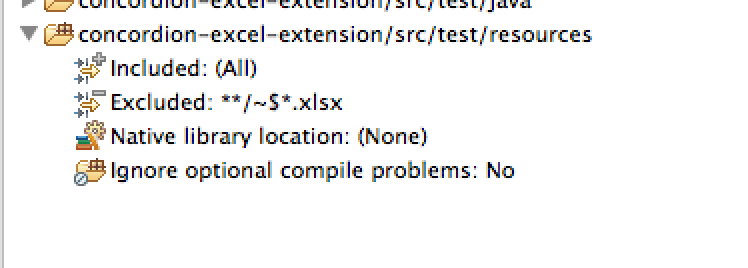

If you are generating the Eclipse .classpath file using Maven, you can add this to your maven pom.xml file to do the same thing:

	<project>
	  ...
	  <build>
	    ...
	    <resources>
	      <resource>
	        <directory>src/main/resources</directory>
	        <filtering>true</filtering>
	        <includes>
	          <exclude>**/~$*.xlsx</include>
	        </includes>
	      </resource>
	      ...
	    </resources>
	    ...
	  </build>
	  ...
	</project>

	
